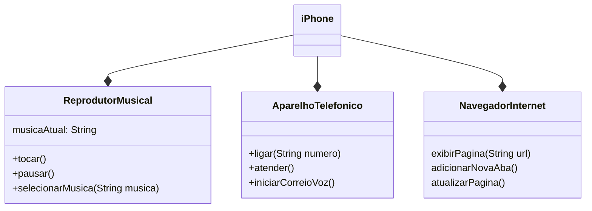

# DESAFIO DE PROJETO - DIO
## Modelagem e Diagramação de um Componente Iphone

Projeto para entrega de desafio de projeto no Bootcamp de Springboot da DIO (Digital Innovation One).

Nesse projeto fiz uma implementação simples em Java, onde chamo os métodos do Iphone que realizam uma saída no terminal/console.

### Modelagem do Componente Iphone

